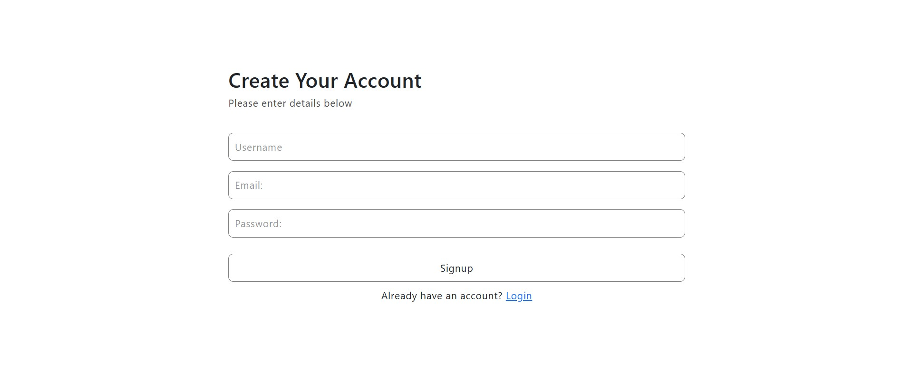
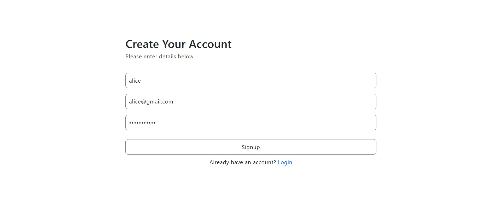
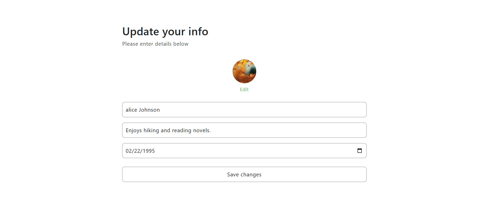

# Social Media Website

## Overview
Social Media Website is a web application built with React and Django REST Framework, offering users a dynamic social experience with features like post creation, following/unfollowing users, liking, commenting, and searching for posts.

## Features
- **User Authentication** - Users can sign up, log in, and update their profile information.
- **Create New Post** -  Users can share text and images.
- **Follow/unfollow Other Users** - Users can follow their friends or favorite content creators and unfollow anytime.
- **Commenting and Liking Posts** - Engage with posts through comments and likes.
- **Search For Posts** - Easily find posts by keywords.

## Tech Stack
- **Frontend:** React, HTML, CSS (Tailwind CSS), Axios, Vite 
- **Backend:** Django REST Framework (DRF)
- **Other Tools:** Git, GitHub 

## Feature Previews
- *Sign Up Page.*

- *Entering new user information.*

- *Entering profile information.*

- *Follow/unfollow users, commenting, liking, sharing new post and search for posts.*

